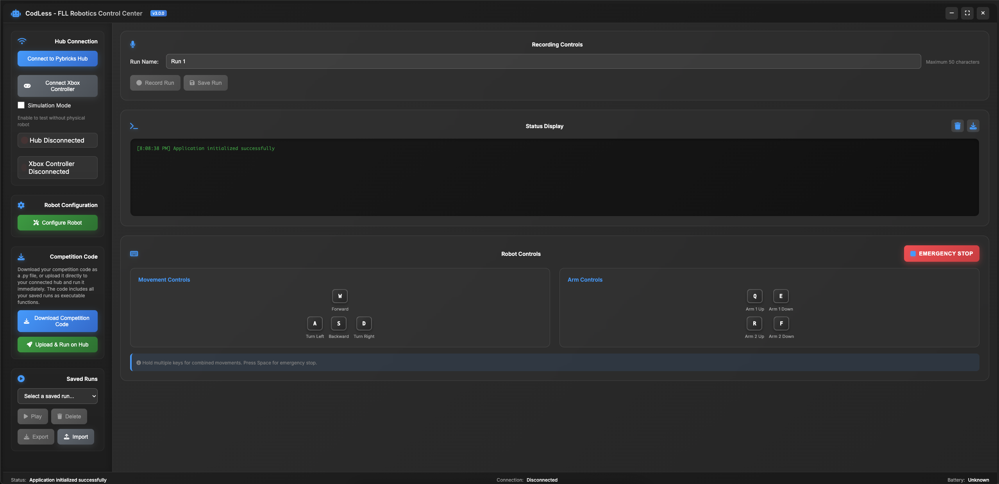
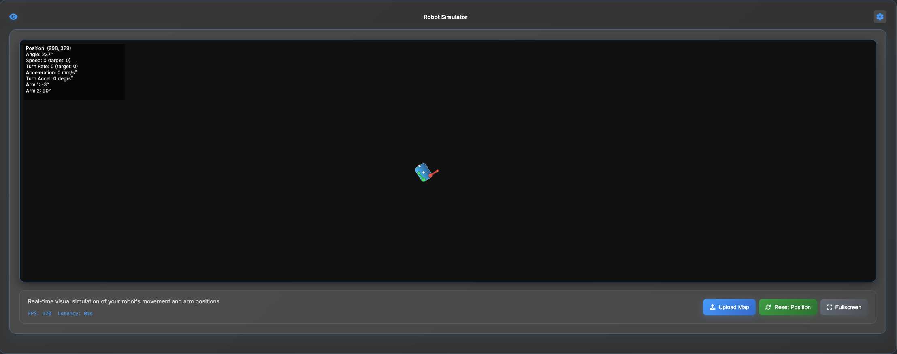

# CodLess

**Visual programming for FLL teams**

CodLess is a web-based tool that helps FIRST LEGO League teams program their robots without writing complex code. You can connect your LEGO hub, record movements, save them as reusable runs, and use them during competitions.

**🔐 New: Secure Cloud Storage** - Sign in with email or Google to save your robot runs to the cloud, access them from any device, and collaborate with your team!

## [Live Demo](https://rani367.github.io/CodLess/)

---

## Features

- Connect to Pybricks-compatible LEGO hubs using Bluetooth
- Record robot movements and save them as named runs
- Upload and run Python code directly on the hub
- Real-time 2D simulation of robot movements
- Motor calibration for accurate control
- Export and import saved runs
- Works offline after the first load
- Runs in the browser, no installation needed
- **🔐 Secure Authentication**: Sign in with email/password or Google account
- **☁️ Cloud Storage**: Save runs to the cloud and access from any device
- **🔄 Real-time Sync**: Changes automatically sync across all your devices
- **🔒 Private & Secure**: Your data is encrypted and only accessible by you

---

## Quick Start

1. Open [CodLess](https://rani367.github.io/CodLess/) in Chrome, Edge, or Opera
2. Click **Connect Robot** to pair with your Pybricks hub
3. Configure motor ports in the settings
4. Record movements using the control panel
5. Save runs with custom names for later use
6. Replay runs or export them as Python code

---

## How the app looks:

  
*Control panel with recording options*

  
*Real-time 2D robot simulation for testing runs*

---

## Instant Multi-Device Authentication

CodLess includes **automatic multi-device sync** that works immediately - **ZERO SETUP REQUIRED!**

### ✨ How It Works:
Just use the **same email/password on any device** - your data syncs automatically!
No codes, no Firebase, no configuration needed.

### Features:
- 🔒 **Secure Authentication** - Password-protected accounts
- 📧 **Email/Password Login** - Create accounts with any email
- 🔄 **Automatic Multi-Device Sync** - Same login = same data everywhere
- 💾 **Persistent Storage** - Your runs are saved to your account
- 🌍 **Cross-Device Access** - Sign in anywhere, data appears instantly
- 🛡️ **User Isolation** - Each user's data is completely separate
- 🚀 **Always Free** - No external services or costs
- 📱 **Works Everywhere** - Phone, tablet, laptop - all synced!

### Using the Authentication:
1. **Click the user icon** (👤) in the top-right corner
2. **Create an account** with email/password
3. **On another device**: Just sign in with the same email/password
4. **All your runs appear automatically!**

### How It Works Behind the Scenes:
- Your email creates a unique namespace for your data
- Data is stored locally but keyed to your email
- When you sign in on a new device, it finds your data
- No servers, no cloud - just smart local storage

### Privacy & Security:
- Passwords are securely hashed
- Each email has isolated data storage
- No external servers or databases
- Works even offline (after first load)
- Your data never leaves your devices

### Perfect For:
- FLL teams working on multiple devices
- Competitions where you switch computers
- Students accessing their runs from home/school
- Coaches managing team programs
- Anyone who uses multiple devices

### Example Use Cases:

**Personal Use:**
1. Create account on laptop: `student@school.edu`
2. Sign in on phone with same credentials
3. All robot runs appear instantly!

**Team Sharing:**
1. Team creates shared account: `team123@fll.com`
2. All members sign in with team credentials
3. Everyone sees and can use the same runs
4. Changes sync automatically

### Quick Sign-In Option:
Click "Continue with Google" and enter just your email for instant access!

---

## Contributing

We welcome contributions from the FLL community:

1. Fork the repository
2. Create a feature branch
3. Make your changes
4. Open a pull request

Please follow the existing style and add clear documentation for new features.

---

## License

This project is licensed under the terms in the [LICENSE](LICENSE) file.
